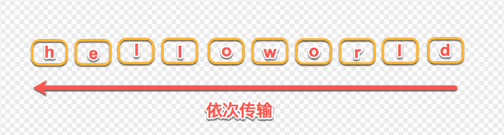

# HTTP

## HTTP/2的三大特性, 与HTTP/1.1的区别

HTTP/2的三大特性: **头部压缩、Server Push、多路复用**

HTTP/2在HTTP/1.1有几处基本的不同:

- HTTP/2是二进制协议而不是文本协议。不再可读，也不可无障碍的手动创建，改善的优化技术现在可被实施。
- 这是一个复用协议。并行的请求能在同一个链接中处理，移除了HTTP/1.x中顺序和阻塞的约束。
- 压缩了headers。因为headers在一系列请求中常常是相似的，其移除了重复和传输重复数据的成本。
- 其允许服务器在客户端缓存中填充数据，通过一个叫服务器推送的机制来提前请求。

> 参考文献：
>
> 1. [MDN: HTTP/2](https://developer.mozilla.org/zh-CN/docs/Glossary/HTTP_2)
> 2. [MDN: HTTP/2 - 为了更优异的表现](https://developer.mozilla.org/zh-CN/docs/Web/HTTP/Basics_of_HTTP/Evolution_of_HTTP#http2_-_%E4%B8%BA%E4%BA%86%E6%9B%B4%E4%BC%98%E5%BC%82%E7%9A%84%E8%A1%A8%E7%8E%B0)

## 解决域名请求并发数量限制

浏览器使用并行连接，但它们将并行连接的总数限制为少量（通常为4，6个）

### HTTP 1.1情况下

Keep-Alive解决的核心问题：一定时间内，同一域名多次请求数据，只建立一次HTTP请求，其他请求可复用每一次建立的连接通道，以达到提高请求效率的问题。这里面所说的一定时间是可以配置的，不管你用的是Apache还是nginx。

如上面所说，在HTTP1.1中是默认开启了Keep-Alive，他解决了多次连接的问题，但是依然有两个效率上的问题：

- 第一个：串行的文件传输。当请求a文件时，b文件只能等待，等待a连接到服务器、服务器处理文件、服务器返回文件，这三个步骤。我们假设这三步用时都是1秒，那么a文件用时为3秒，b文件传输完成用时为6秒，依此类推。（注：此项计算有一个前提条件，就是浏览器和服务器是单通道传输）
- 第二个：连接数过多。我们假设Apache设置了最大并发数为300，因为浏览器限制，浏览器发起的最大请求数为6，也就是服务器能承载的最高并发为50，当第51个人访问时，就需要等待前面某个请求处理完成。

综上所述：通古多域名提高浏览器的下载速度。将静态文件图片打到两个或多个域名，这样浏览器就可以对 n * 6 个文件进行同时下载，避免了浏览器6个通道的限制，这样做的缺点也是明显的，1.DNS的解析时间会变长。2.增加了服务器的压力。

### HTTP 2情况下

HTTP/2的多路复用就是为了解决上述的两个性能问题，我们来看一下，他是如何解决的。

- 解决第一个：在HTTP1.1的协议中，我们传输的request和response都是基本于文本的，这样就会引发一个问题：所有的数据必须按顺序传输，比如需要传输：hello world，只能从h到d一个一个的传输，不能并行传输，因为接收端并不知道这些字符的顺序，所以并行传输在HTTP1.1是不能实现的。

HTTP/2引入二进制数据帧和流的概念，其中帧对数据进行顺序标识，如下图所示，这样浏览器收到数据之后，就可以按照序列对数据进行合并，而不会出现合并后数据错乱的情况。同样是因为有了序列，服务器就可以并行的传输数据，这就是流所做的事情。

- 解决第二个问题：HTTP/2对同一域名下所有请求都是基于流，也就是说同一域名不管访问多少文件，也只建立一路连接。同样Apache的最大连接数为300，因为有了这个新特性，最大的并发就可以提升到300，比原来提升了6倍！

### 总结

有了HTTP/2之后，根据上面讲的原理，我们就不用这么搞了，成本会更低。

> 参考文献：
> [浅析HTTP/2的多路复用](https://segmentfault.com/a/1190000011172823?utm_source=tag-newest)

## HTTP缓存，具体强缓存的字段和协商缓存的字段

> 题目来源：2020.12-百度 一面
